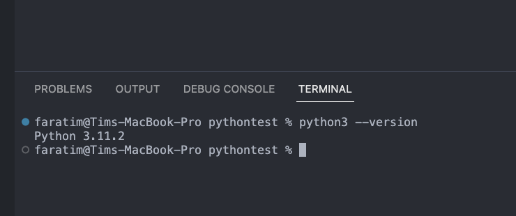
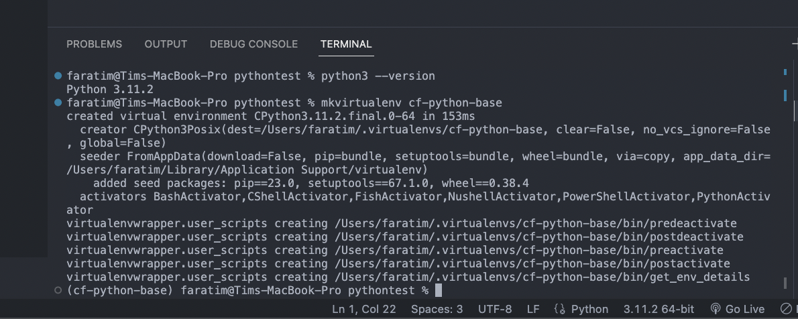
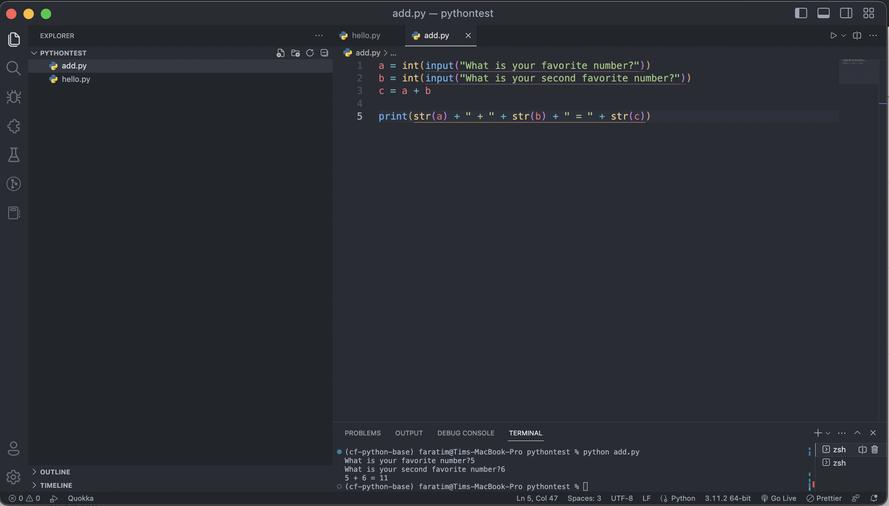
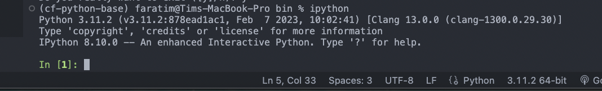
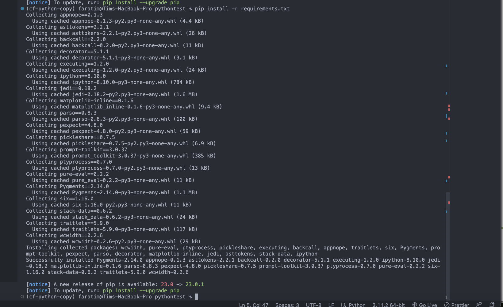

# Python Cheat Sheet

Create a new Virtual Environment - $ mkvirtualenv nameofnewenvironment

Activate Virtual Environment - Navigate to virtual environment path (Users/faratim/.virtualenvs/environment name/bin), then type 'source activate' in terminal without the quotes. The current path I'm working with is Users/faratim/.virtualenvs/cf-python-base/bin.

Initiate iPython Shell = While in Virtual Env path, type 'iPython'

# Exercise 1.1

In this exercise, I learned how to install Python, set up a Python environment, write and run a Python script using a code editor and a terminal, run commands on an interactive Python shell, and install new packages using pip.

### Install Python

 

### Set Up Virtual Environment

 

### Create add.py

 

### Set Up IPython Shell

### Requirements File

 

### Learning Journal

A link to my learning journal for this course can be found at [THIS LINK](https://docs.google.com/document/d/1ivQZUXAxUzJ5r3ClSk_WxIMY2KOYSkqG/edit?usp=sharing&ouid=114664645213156620235&rtpof=true&sd=true)
